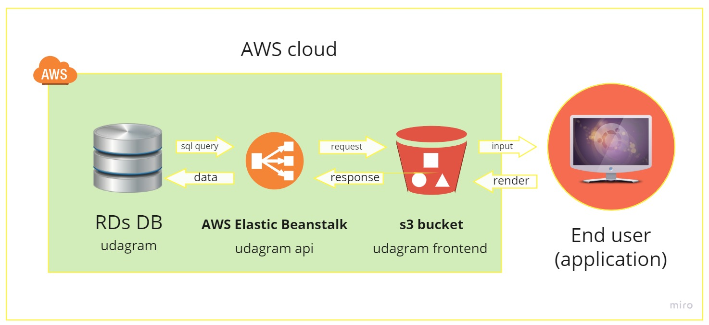

# Udagram

This fullstack application was provided to me to practice AWS services on, I didn't use my own application because it will be more challenging to work on someone else's code.

`all other documentation will be found in [documentation](./documentation/)`

## Getting Started

1. cd udagram-api && npm install && npm run dev
1. cd udagram-frontend && npm install && npm run start
1. relax, as every thing else is automated using circleci pipeline

### Dependencies

- node.js

- AWS CLI v2

- A RDS database running Postgres.

- A S3 bucket for hosting uploaded pictures.

``

## Diagram

## frontend url

[frontend deploy](http://my-udagram-udacity.s3-website-us-east-1.amazonaws.com)

## Built With

- [Angular](https://angular.io/) - Single Page Application Framework
- [Node](https://nodejs.org) - Javascript Runtime
- [Express](https://expressjs.com/) - Javascript API Framework

### pipeline

1. install node
1. setup aws cli
1. install frontend
1. install backend
1. build the frontend
1. build the backend
1. deploy the frontend

## License

[License](LICENSE.txt)
